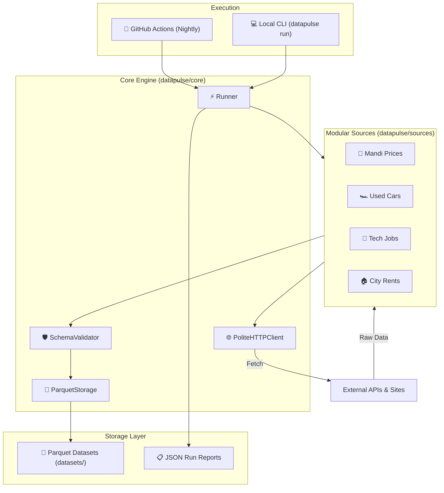

# DataPulse-India

An automated, multi-dataset data hub for India. One pipeline collects daily
time-series across several domains — mandi (food) prices, used cars, city rents,
tech-job demand — validates every row against a declared schema, and commits
date-partitioned parquet to this repo. Runs nightly on GitHub Actions for ₹0.

> Status: **foundation**. Core platform, CI, and one reference source are in
> place; additional sources are being added one file at a time.

## Quick start

```bash
pip install -e ".[dev]"
cp .env.example .env

datapulse list
datapulse run --source mandi_prices --dry-run
```

## System Architecture & Data Flow



See [docs/ARCHITECTURE.md](docs/ARCHITECTURE.md) for full sequence diagrams, process flowcharts, class models, and data contract specifications.

## Layout

```
datapulse/
  core/          config, http, schema, storage, runner, logging  <- stable platform
  sources/       one file per dataset                            <- where growth happens
  cli.py
config/settings.yaml   non-secret config (enable/disable, tuning)
datasets/              date-partitioned parquet, committed daily
  <domain>/<source>/year=YYYY/month=MM/<source>_YYYY-MM-DD.parquet
  _runs/               JSON run reports
dashboard/             static GitHub Pages site
docs/                  architecture, adding a source, data ethics
```

## Adding a dataset

One module in `datapulse/sources/`, one block in `config/settings.yaml`. Nothing
in `core/` changes. See [docs/ADDING_A_SOURCE.md](docs/ADDING_A_SOURCE.md).

## Design notes

- **Schema-validated writes** — a broken scraper fails the run instead of
  poisoning the archive.
- **Idempotent, date-partitioned storage** — retries and backfills never duplicate rows.
- **Isolated sources** — one failure doesn't take the nightly run down; the run
  report records what happened.
- **Swappable storage** — `Storage` is a Protocol; local parquet today, S3 or
  DuckDB later without touching a source.
- **Polite by default** — shared rate limiter, backoff, identifying User-Agent,
  robots.txt honoured. See [docs/DATA_ETHICS.md](docs/DATA_ETHICS.md).
- **Secrets never in git** — env-only, gitleaks in pre-commit and CI. See [SECURITY.md](SECURITY.md).

Full rationale: [docs/ARCHITECTURE.md](docs/ARCHITECTURE.md).

## License

MIT for the code. Each dataset carries the licence of its upstream source —
documented in that source's module docstring.
