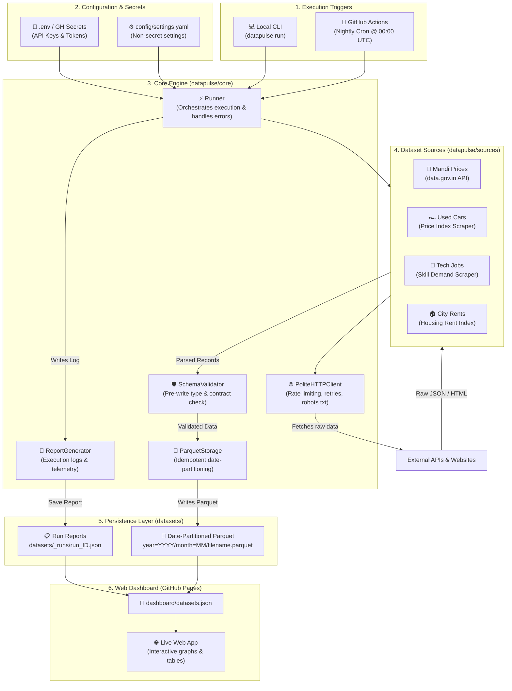
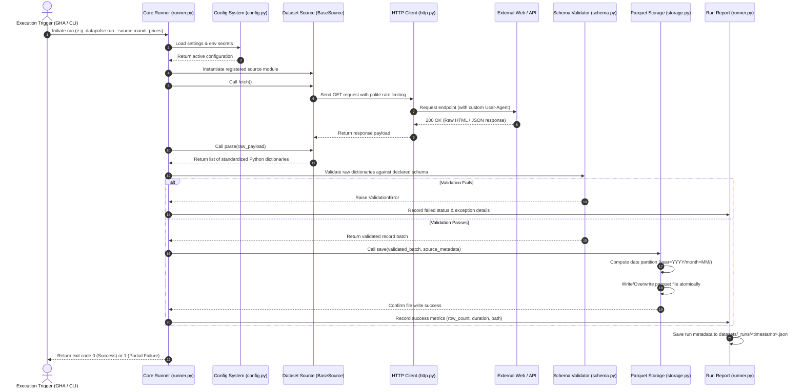
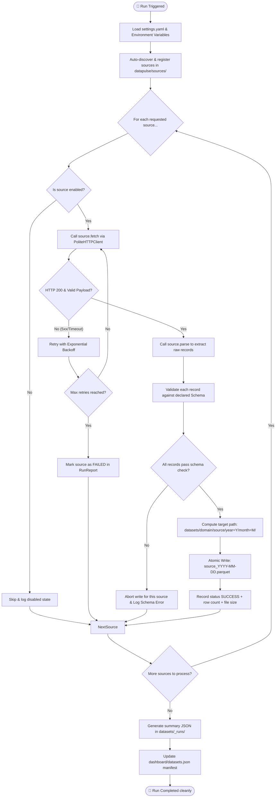
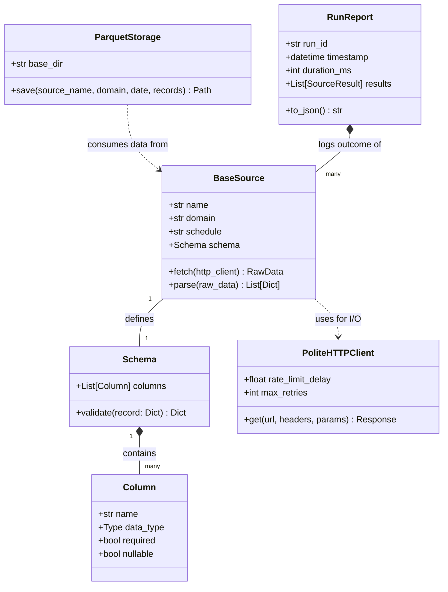

# DataPulse-India: Architecture & Data Flow Specification

This document provides a comprehensive breakdown of the system architecture, process flows, data pipelines, and component relationships using Mermaid diagrams and detailed technical specifications. It is designed so that any engineer, reviewer, or third party can immediately understand how DataPulse-India operates.

---

## 1. System Context & Component Architecture

DataPulse-India is designed as an **Automated, Multi-Dataset Open-Data Platform**. The platform isolates core engine logic from domain-specific scrapers so that adding new datasets requires zero modifications to the core engine.

---

## 2. End-to-End Data Pipeline Flow

The following sequence diagram details the step-by-step lifecycle of a data collection job—from trigger initiation to dashboard updates.

---

## 3. Detailed Process Flowchart

This flowchart outlines the decision logic, error handling, and guardrails enforced during data collection:

---

## 4. Class & Data Contract Model

The object model is built around strict interfaces and data contracts:

---

## 5. Architectural Guarantees & Principles

| Layer | Module | Enforced Rule / Contract |
|---|---|---|
| **Configuration** | `datapulse/core/config.py` | Non-secrets in YAML, secrets **only** via environment variables/GitHub Secrets. |
| **Data Contract** | `datapulse/core/source.py` | Every dataset is strictly `fetch()` (network) + `parse()` (transformation). |
| **Schema Guard** | `datapulse/core/schema.py` | Zero writes permitted unless incoming records pass declared data type checks. |
| **Network Discipline** | `datapulse/core/http.py` | Built-in rate limiter, exponential backoff retries, user-agent headers, and robots.txt compliance. |
| **Storage Engine** | `datapulse/core/storage.py` | Idempotent date-partitioned Parquet storage (`year=YYYY/month=MM/`). Re-runs overwrite cleanly without duplication. |
| **Fault Isolation** | `datapulse/core/runner.py` | A single source failure (e.g. site structure change) never halts other sources. Run results are logged to JSON. |

---

## 6. How a 3rd Party Developer / Recruiter Understands This Project

When explaining this project to a colleague, tech lead, or recruiter:
1. **It's a Data Engine, not just scrapers**: The core engine manages retries, schemas, and parquet storage automatically.
2. **Adding a dataset takes 5 minutes**: Create `datapulse/sources/my_dataset.py`, inherit `BaseSource`, define columns, and add 4 lines to `config/settings.yaml`.
3. **Zero Maintenance Infra**: Runs nightly on GitHub Actions without needing an EC2 instance, database server, or monthly cloud bill.
4. **Clean Web UI**: The static HTML/JS dashboard reads parquet metadata via `datasets.json` to showcase interactive charts.
